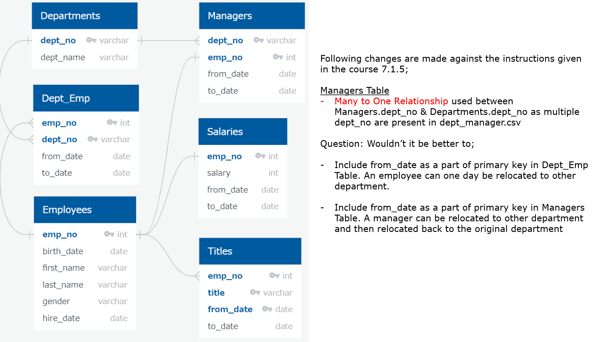
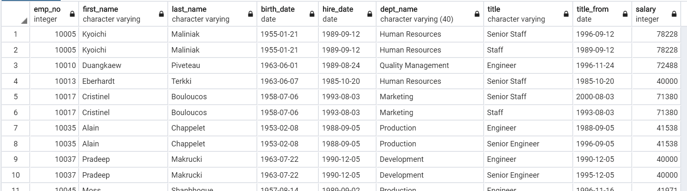
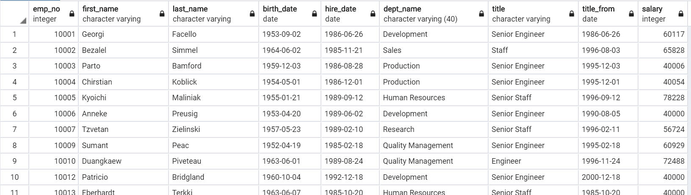
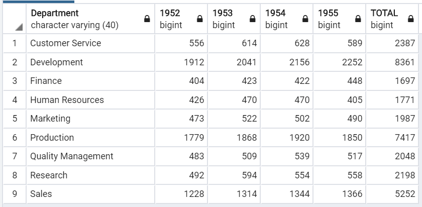
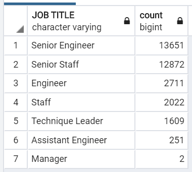
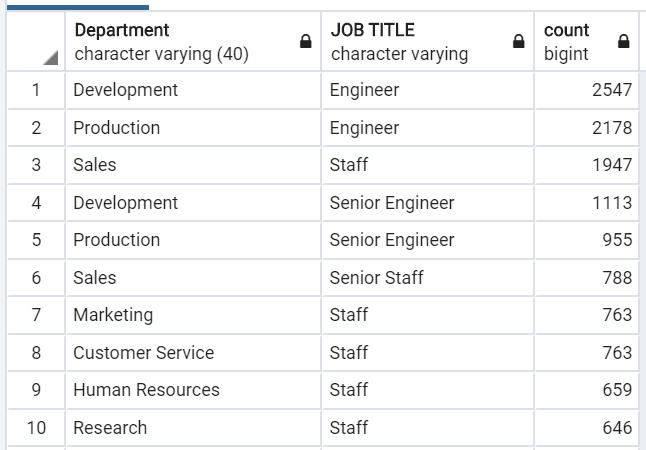
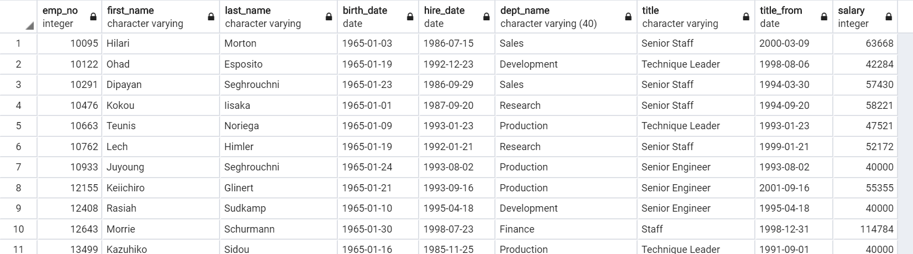
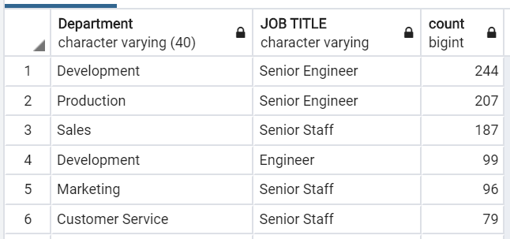

# Pewlett-Hackard-Analysis
Module 07 of UofT Data Analytics Boot Camp

### Project Objective
To analyze the Human Resource (HR) data of Pewlett Hackard (PH) to better prepare for the rapid retirement of baby boomers.

Project is broken down to 3 key steps.
1. Create SQL Database using CSV files
2. Prepare Combined and Filtered Tables in SQL DB for the Analysis
3. Conduct detailed analysis to assess the impact of the retirement of baby boomers


### 1. Preparing SQL Database
From 6 CSV files provided by HR, SQL Database for HR department was created based on the ERD design shown below.




### 2. Combining Tables & Filtering Data
As a first step of the analysis, the table "current_employees_full", which contains details of current employees such as name, hired date, department, historical job titles, salary etc. was created by following SQL query.

Note: To make the following analysis easier, some columns which were not included in the Module instruction were added to the table 

```sql
-- Challenge Assignment Part 1 Step 1
SELECT e.emp_no, first_name, last_name, birth_date, hire_date, 
       dept_name, 
       title, t.from_date title_from, 
       salary
INTO current_employees_full
FROM employees e
INNER JOIN titles t ON e.emp_no = t.emp_no
LEFT JOIN salaries s ON e.emp_no = s.emp_no
LEFT JOIN dept_emp de ON e.emp_no = de.emp_no -- To be used for further analysis
LEFT JOIN departments d ON de.dept_no = d.dept_no
WHERE de.to_date = '9999-01-01'; -- Include only current employees
```

The top 10 rows of the table look like below.




As Table "titles" contain historical record of job titles for each employee, the following query was used to extract data related to only the current job title.

```sql
SELECT  emp_no, first_name, last_name, birth_date, hire_date,
        dept_name, title, title_from, salary
INTO current_employees_current_job
FROM (SELECT *, 
	 ROW_NUMBER() OVER (PARTITION BY emp_no ORDER BY title_from DESC) AS JobCount
	 FROM current_employees_full
	) withjobcount
WHERE JobCount = 1;
```

The top 10 rows of the table look like below.



### 3. Summary of Analysis
#### 3.1 Number of Employee Eligible to Retirement per Department
Employees who furfill following conditions are eligible to retirement and they could also be the potential candidates for the part-time mentoring job.
* born between 1952 and 1955
* hired between 1985 and 1988

Number of retiring employees per departments by their birth year was determined by following query.
```sql
SELECT  dept_name AS "Department",
        COUNT(*) FILTER (WHERE EXTRACT(YEAR from birth_date) = 1952) AS "1952",
        COUNT(*) FILTER (WHERE EXTRACT(YEAR from birth_date) = 1953) AS "1953",
        COUNT(*) FILTER (WHERE EXTRACT(YEAR from birth_date) = 1954) AS "1954",
        COUNT(*) FILTER (WHERE EXTRACT(YEAR from birth_date) = 1955) AS "1955",
        COUNT(*) AS "TOTAL"
FROM current_employees_current_job
WHERE birth_date BETWEEN '1952-01-01' AND '1955-12-31'
    AND hire_date BETWEEN '1985-01-01' AND '1988-12-31'
GROUP BY dept_name;
```

The results indicates that;
* Approx. 33,000 employees are eligible of retirement
* Approx. 8,000 employees would retire every year for next 4 years.
* Development, Production and Sales departments have the highest number of employees retiring.
* Finance, HR and Quality Management departments have the least number of employees retiring.



#### 3.2 Retirement by Job Title
Number of retiring employees by job title was determined by following query.
```sql
SELECT title AS "JOB TITLE", COUNT(*)
FROM current_employees_current_job
WHERE birth_date BETWEEN '1952-01-01' AND '1955-12-31'
    AND hire_date BETWEEN '1985-01-01' AND '1988-12-31'
GROUP BY title
ORDER BY COUNT(*) DESC;
```

The results indicates that;
* Significantly high number of senior engineers and senior staffs are retiring soon.
* 2 management position need to be filled soon.



#### 3.3 New Hire by Department & Job Title
To check the balance between new hire and retirement, following query was used to determine the number of new hires per department and job title.

Note that as the latest year of employment was 2000, individuals who were hired since 1996 (past 4 years) were consided as new hire.

```sql
SELECT dept_name AS "Department", title AS "JOB TITLE", COUNT(*)
FROM current_employees_current_job
WHERE hire_date >= '1996-01-01'
GROUP BY dept_name, title
ORDER BY COUNT(*) DESC;
```

The result indicates that;
* Approx. 17,500 were hired within 4 years. This is about half of the number of retiring employees.
* Engineers in Development, Engineers in Production and Staff in Sales are top 3 new hires, which matches with the breakdown of the retiring employees.



#### 3.4 Candidates for Supervisory Role
Training the employee for the supervisory role is as important as training of the new hire. Employees who were born in 1965 are potential candidates for the next supervisory role and . Following query was used to create the list of candidates for the mentorship program.

```sql
SELECT * 
INTO candidates_supervisor
FROM current_employees_current_job
WHERE birth_date BETWEEN '1965-01-01' AND '1965-12-31';	
```

The list of individuals who are ready for mentoring looks like below.



The list incicates that (similar query as 3.3 used);
* Approx. 1,500 individuals are eligible for the mentorship program.
* Senior Engineers in Development, Senior Engineers in Production and Senior Staff in Sales are top 3 jobs eligible for the supervisory role.



### Future Development
For the further analysis, I would recoomend to calculate the total salary of retiring employees in each department. and compare with the total salary of new hires in each departments. This will provide the managers of each department the idea of the budget they can use for new hire, training program and other investments.